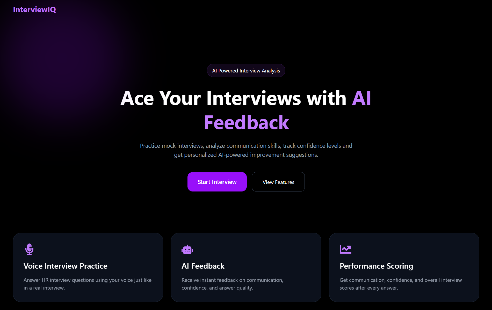
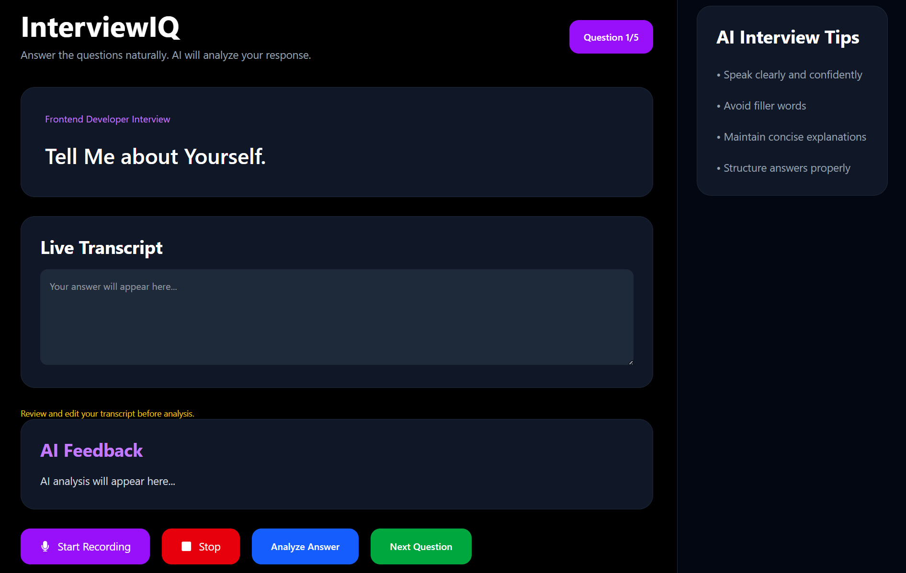
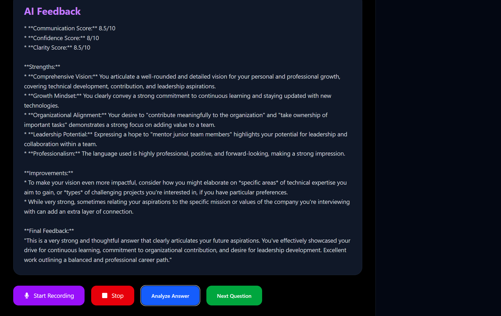
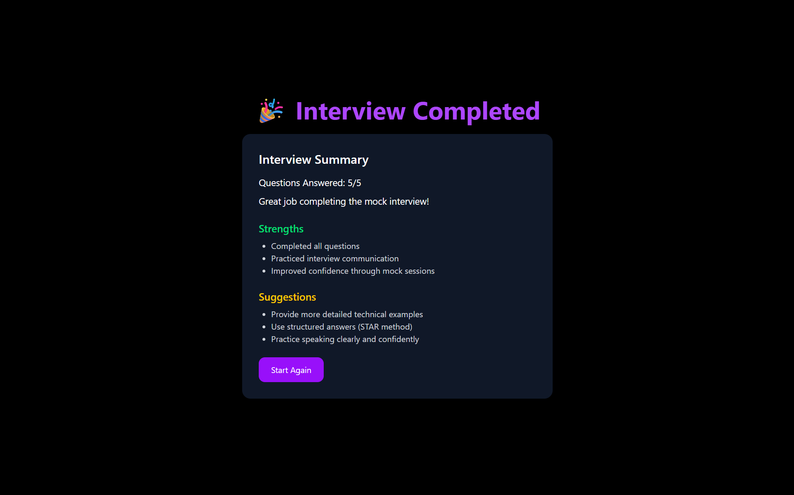

# 🎤 InterviewIQ – AI Powered Mock Interview Platform

InterviewIQ is an AI-powered mock interview application that helps users practice interview questions, improve communication skills, and receive personalized feedback using Google's Gemini AI.

## 🚀 Live Demo

🔗 https://interview-iq-ai-black.vercel.app

---

## ✨ Features

* 🎙️ Voice-based interview practice
* 🤖 AI-powered answer evaluation using Gemini AI
* 📊 Communication, Confidence, and Clarity scoring
* 💡 Personalized strengths and improvement suggestions
* 📋 Live transcript generation
* 🔄 Multiple interview questions in a single session
* 🎯 Final interview summary and recommendations
* 🌙 Modern responsive UI

---

## 🛠️ Tech Stack

### Frontend

* React.js
* Vite
* JavaScript
* CSS3

### AI Integration

* Google Gemini API

### Deployment

* Vercel

### Version Control

* Git & GitHub

---

## Screenshots

### Home Page

### Interview Page

### AI Feedback

### Interview Summary

---

## 🎯 Future Improvements

* Support for multiple interview domains
* Detailed performance analytics
* User authentication
* Interview history tracking
* Downloadable feedback reports
